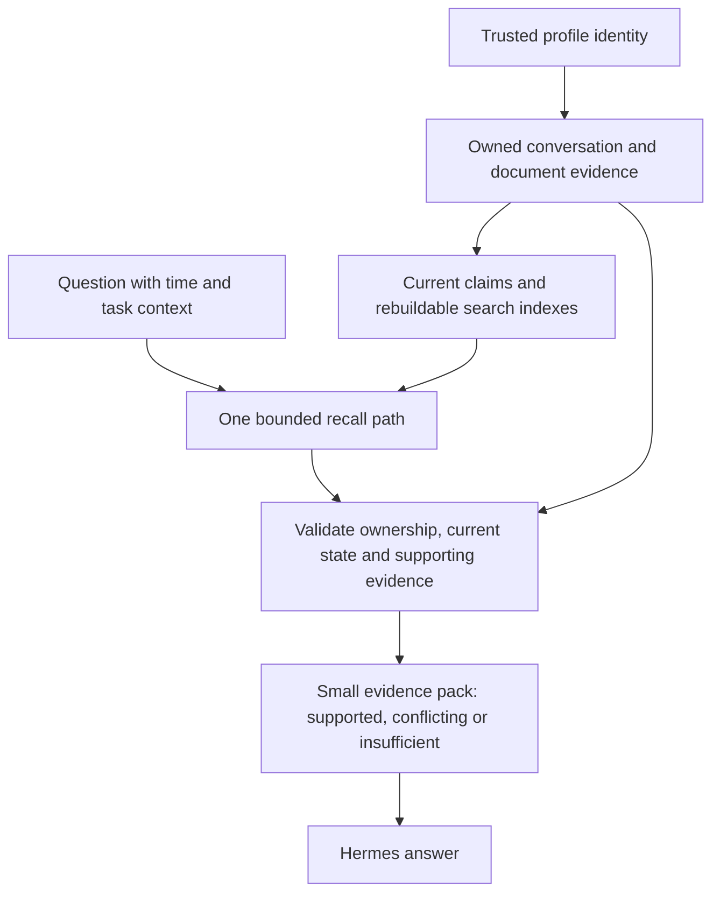

# A simpler memory model for Hermes

Status: design proposal, not a claim of measured answer-quality improvement.
Implemented groundwork: Remnant 0.3.2 simplifies the existing recall path while
preserving all capabilities, defaults, schema 17 and stored vectors.

## What the system must accomplish

Hermes must remember what was actually said or observed, apply the relevant
current information, explain conflicts and past states, and decline to invent
missing information. It must do this within a small response-time and context
budget. A profile must never receive another profile's evidence, including via
caches, graphs, imports, generated summaries or background jobs.

The objective is correct, supported answers per unit of latency, context and
memory. A high similarity score, many stored facts, or a large number of recalled
items is not the objective. Likewise, fewer lines alone do not establish lower
RAM use or better answers.

## The central design

Keep SQLite as the authoritative store. Treat extracted facts, embeddings,
graph relationships and summaries as ways to find and interpret evidence.
Retain the original conversation turns and document provenance so a lossy
extraction is not the only account of what happened.

There are three distinct kinds of stored information:

| Kind | Purpose | Treatment |
| --- | --- | --- |
| Source evidence | Preserve what the user, assistant or tool actually supplied | Keep origin, owner, event time and recording time; preserve corrections and explicit forgetting semantics |
| Current claims | Answer questions about preferences, decisions and changing state | Derive from evidence; retain scope, validity and links to competing versions |
| Retrieval aids | Find the right evidence cheaply | Embeddings, FTS, aliases, graph links and generated summaries are rebuildable; avoid making them independent authorities |

Remnant already has much of this structure. The useful evolution is to make
these roles explicit and eliminate parallel policies, rather than start a new
product or introduce another authoritative database.

## Where accuracy can improve

1. **Read supporting evidence for selected results.** A short fact is a useful
   search key, but may omit a condition, reason, exception or qualification.
   For an ambiguous or detailed question, a bounded excerpt from its original
   turn can restore that information. Preserve speaker and source type so an
   assistant suggestion is not silently treated as a user decision.
2. **Separate changing truth from resemblance.** "I used dark mode last year"
   and "I now use light mode" can be near-identical vectors. Select by subject,
   predicate, scope and relevant time; use similarity to find candidates, not
   decide which version is true. Keep unresolved contradictions visible.
3. **Distinguish corroboration from repetition.** Remnant's current
   `ingest._corroborate` boosts memories sharing an entity. That is association,
   and does not establish independent support for the same claim. A copied
   note, dream or repeated extraction should not become an independent witness.
   A future ranking experiment should use supporting source events and explicit
   confirmation, with evaluation before changing production trust semantics.
4. **Support missing-information answers.** A nearest neighbour always exists
   in a nonempty vector store. An evidence pack should say when the retrieved
   material does not establish the requested fact. Test unknown answers,
   wrong-profile matches and contradictions alongside successful recall.
5. **Preserve important constraints.** User restrictions may matter even when
   the current question uses different words. Test whether they affect the
   final answer correctly, rather than counting only retrieved substrings.

LongMemEval tests extraction, multi-session reasoning, updates, temporal
reasoning and abstention. Its authors report that compressing turns solely into
facts loses useful information, while facts can improve retrieval keys. LoCoMo
also tests reasoning across conversations and time. These motivate the design;
their published results do not establish how this proposal performs on Hermes.

Sources: [LongMemEval](https://xiaowu0162.github.io/long-mem-eval/) and
[LoCoMo](https://snap-research.github.io/locomo/).

## Where performance and memory can improve

- Persist a turn and its extraction job once. Keep extraction, dream work and
  other model calls outside foreground recall.
- Make tool recall and prefetch share ownership validation, pending-turn
  handling, claim resolution, ranking and context compilation. Version 0.3.2
  removes the duplicated pending-turn and conversation-deduplication paths.
- Avoid repeated work inside a scan. Version 0.3.2 calculates the unchanged
  query norm once, and ranking bounds once per score lane.
- Test selective retrieval: cheap exact/entity/lexical lookup first, semantic
  retrieval and graph expansion when the question needs them. Only skip a
  retrieval route after a measured decision rule preserves relevant evidence;
  a lexical match by itself is not sufficient proof.
- Keep cached results bounded and invalidated by evidence changes. Reuse the
  existing shared inference service. Account for all gateway processes, model
  residency and any optional GLiNER copies when measuring total fleet RAM.
- Treat ANN and smaller embeddings as separate experiments. ANN adds index
  maintenance and memory overhead; a smaller model can change recall quality.
  Test each variable independently against the existing exact scan.

No new daemon, vector service or model is required for the first experiment.
No feature, including dreams, Echo, graph search, reflection or threads, was
removed or disabled by the simplification release.

## Isolation is an invariant

Bind the effective owner to trusted runtime identity before query planning.
Apply ownership during candidate discovery and revalidate it before evidence
leaves the provider. Background projections inherit their source owner. Cache
keys include identity, scope and evidence generation. A future derived index
should be selected by trusted profile identity and remain reconstructible from
that profile's records.

Source expansion must also obey forgetting, supersession, vault scope and
locked-note rules. It must not resurrect forgotten material by reading an old
raw turn or a cached snippet. An unavailable or ambiguous source link yields
no excerpt. The system must never infer ownership from a copied filename or
model-supplied profile argument.

Current isolation is enforced through Remnant's application APIs. If profiles
can issue unrestricted shell commands under the same OS user, a shared SQLite
file is accessible outside those APIs. Isolation against that threat requires
separate OS permissions or a memory service whose credentials cannot request
another profile. A database per folder alone is insufficient. That deployment
change needs its own migration and control-path review.

## The next bounded experiment

Compare the current recall context with the same selected memories plus bounded,
owner-verified source excerpts. Use disposable databases and the configured real
embedding and answer models; no production writes or automatic re-extraction.
Keep candidate IDs, model version, prompt, context budget and corpus fixed so
we can attribute any improvement to evidence presentation.

Use at least 100 held-out questions covering paraphrases, corrections, historical
state, conditional preferences, facts spread across sessions, unknown answers,
long turns, forgotten information and cross-profile near-duplicates. Separate
fixture development from held-out evaluation. Grade the final answer and its
supporting evidence, with manual review of disagreements; report retrieval and
extraction errors separately.

Technical gates:

- Zero cross-profile disclosure or resurrection of forgotten content.
- No regression in updates, temporal answers, conflicts or abstention; report
  denominators and uncertainty rather than treating one aggregate score as proof.
- Better supported-answer accuracy at the same context budget, across repeated
  paired runs; improvement must exceed normal run-to-run variation.
- Foreground prefetch remains within its configured 500 ms budget, including
  degraded-mode behaviour. Measure p50/p95, not just the fastest cache hit.
- Report end-to-end inference cost, total process/model RAM, index size and
  extraction lag separately from Python allocation peaks.

If the evidence pack helps, add source expansion through the existing recall
service and existing provenance fields, with fail-closed source authorization.
If it does not, keep the simpler current context. Investigate the next observed
failure category instead of stacking more ranking mechanisms onto it.
